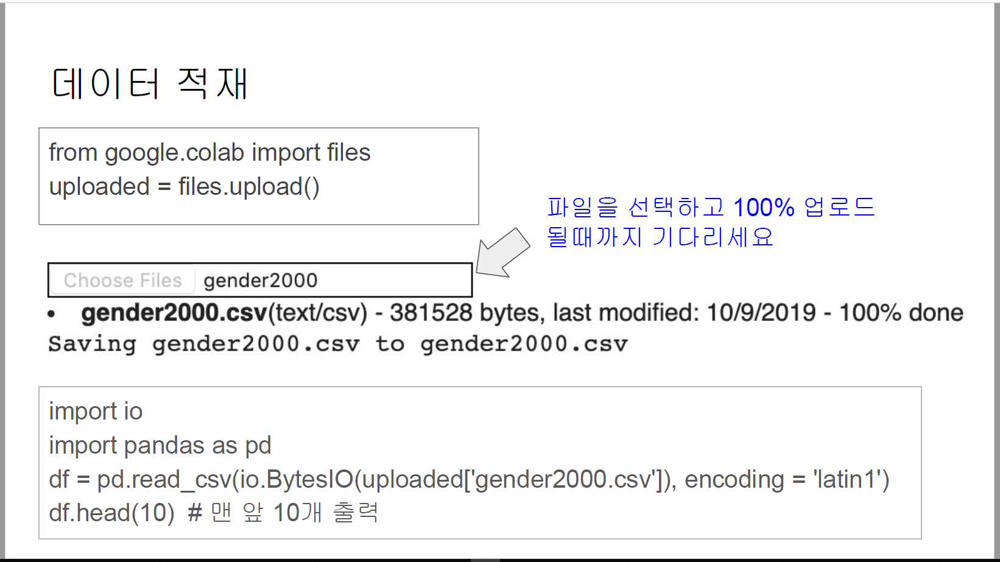

# Colab_upload

from google.colab import files
    uploaded = files.upload()

    import io
    import pandas as pd
    df = pd.read_csv(io,BytesIO(uploaded['gender2000.csv']), encoding = 'latin1')
    df.head(10)

