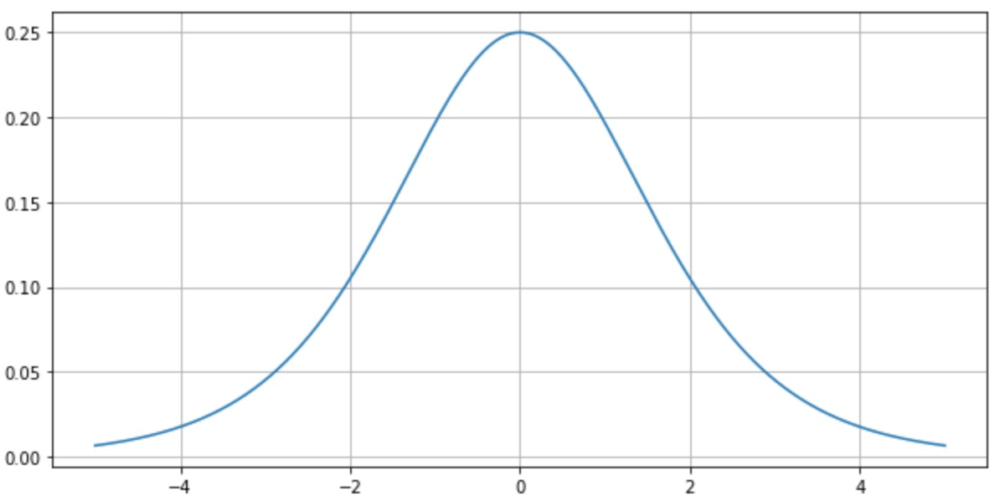
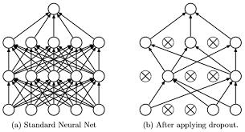

# DL_Study_homework_week_3

## Vanishing problem

Gradient 기반의 method는 parameter value의 작은 변화가 network output에 얼마나 영향을 미칠지를 이해하는 것을 기반으로 parameter value를 학습시킨다.

Vanishing gradient problem은 activation function을 선택하는 문제에 의존적으로 일어난다. sigmoid나, tanh 등 activation function들은 매우 비선형적인 방식으로 그들의 input을 매우 작은 output range로 좁혀버린다.

예를 들어서, sigmoid는 실수 범위의 수를 [0, 1]로 맵핑한다. 그 결과로 매우 넓은 input space 지역이 극도로 작은 범위로 맵핑되어버린다.

이렇게 되어 버린 input space에서는 큰 변화가 있다고 하더라도, output에는 작은 변화를 보이게 된다. gradient(기울기)가 작기 때문이다.

특히 이러한 현상은 레이어가 쌓이면 쌓일 수록 악화된다.
즉, input에서 큰 변화가 있다 하더라도 output에 미치는 영향이 극소화 되어 output을 변화시키지 못하게 되는 것이다.

## Drop out

과적합(overfitting)의 위험을 줄이고 학습속도의 개선을 위해 고안된 방법

Neural network의 연결을 임으로 삭제하는 방법
고르는 기준은 랜덤하게 결정한다.

## Batch size

메모리의 한계와 속도 저하 때문에 대부분의 경우에는 한 번의 epoch에서 모든 데이터를 한꺼번에 집어 넣을 수는 없다. 그래서 데이터를 나누어서 주게 되는데 이때 몇 번 나누어서 주는가를 iteration, 각 iteration마다 주는 데이터 사이즈를 batch size라고 합니다.