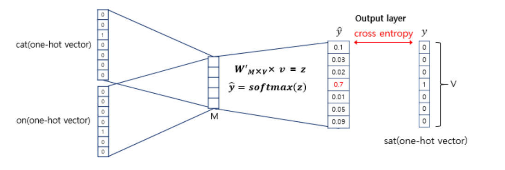

# DL_study_homework_week_4

## Word embedding

워드 임베딩(Word Embedding)은 **단어를 벡터**로 표현하는 대표적인 방법으로 주로 희소 표현에서 밀집 표현으로 변환하는 것을 의미한다.

---

## one_hot_encoding

다음과 같이 3가지 꽃의 종류가 있다고 가정하자.

0: 장미, 1: 튤립, 2: 백합

상위 3가지의 꽃이 데이터 셋에 각각 해당 타입의 숫자의 배열로 되어 있다.

예시)

`[0, 1, 2, 1, 2, 0, 0, 0, 1, 2, …]`

머신러닝을 태울때, 위와 같이 0, 1, 2의 데이터가 들어간다면, 장미 / 튤립 / 백합은 서로 관계 없는 꽃의 종류일지라도 숫자로 표현 되어있기 때문에 학습을 할 때 영향을 미칠 수 있다.

더욱 쉽게 예로 설명하자면,

1 + 1 = 2 라는 수식이 곧,

튤립 + 튤립 = 백합

이라는 결과를 초래할 수 있다는 점이다.

이를 방지하기 위해

꽃의 종류가 3 가지라면, 별도의 3개의 column을 만들고 3개의 column 중 해당 타입의 column 에만 1, 다른 column은 0을 대입해주는 pre-processing 을 거쳐야 하고, 이는 곧 one-hot encoding 의 기법이다.

즉, 다음과 같이 바뀌게 된다.

`[1, 0, 0]`

`[0, 1, 0]`

`[0, 0, 1]`

`[0, 1, 0]`

`[0, 0, 1]`
...

### Argmax, Argmin

    import numpy as np
    
    y_class = np.array([0, 1, 0, 1, 2].reshape(-1,1))

    from sklearn.preprocessing import OneHotEncoder
    enc = OneHotEncoder()
    enc.fit(y_class)
    y_class_onehot = enc.transform(y_class).toarray()

`OneHotEncoder`의`fit`함수로 만든 배열은 희소행렬이므로`toarray()`함수를 활용하여 한 행으로 만든다.

    y_class_recovery = np.argmax(y_class_onehot, axis = 1).reshape(-1,1)

---

## TF-IDF

TF-IDF(Term Frequency - Inverse Document Frequency)는 정보 검색과 텍스트 마이닝에서 이용하는 가중치로, 여러 문서로 이루어진 문서군이 있을 때 어떤 단어가 특정 문서 내에서 얼마나 중요한 것인지를 나타내는 통계적 수치.

**tf(d, t) : 특정 문서 d에서의 특정 단어 t의 등장 횟수** **idf(d, t) : df(t)에 반비례하는 수** **df(t) : 특정 단어 t가 등장한 문서의 수**

$$\operatorname{idf}(d, t) = {\log ({n \over 1+ \operatorname{df}(t)})}$$

df(t)에 역수를 취하면 총 문서의 수 n이 커질수록 idf(d,t)의 값은 기하급수적으로 커지게 된다. 따라서 log를 취해준다.

TF-IDF는 모든 문서에서 자주 등장하는 단어는 중요도가 낮다고 판단하며, 특정 문서에서만 자주 등장하는 단어는 중요도가 높다고 판단한다. TF-IDF 값이 낮으면 중요도가 낮은 것이며, TF-IDF 값이 크면 중요도가 큰 것이다. 즉, the나 a와 같이 불용어의 경우에는 모든 문서에 자주 등장하기 마련이기 때문에 자연스럽게 불용어의 TF-IDF의 값은 다른 단어의 TF-IDF에 비해서 낮아지게 된다.

---

## word2vec

### 희소 표현(Sparse Representation)

one-hot encoding을 통해서 나온, 표현하고자 하는 단어의 인덱스의 값만 1이고, 나머지 인덱스에는 전부 0으로 표현되는 벡터 표현방법, 원-핫 벡터(one-hot vector)이다. 이렇게 벡터 또는 행렬의 값이 대부분이 0으로 표현되는 방법을 희소 표현(Sparse Representation)이라 한다,

### 분산 표현(Distributed Representation)

분산 표현은 ***비슷한 위치에서 등장하는 단어들은 비슷한 의미를 가진다*** 라는 가정 하에 만들어진 표현 방법이다. 예를 들어 `고양이`란 단어는 `귀엽다`, `예쁘다`, `애교` 등의 단어가 주로 쓰이는데, 이러한 텍스트를 벡터화한다면 의미적으로 가까운 단어가 된다.

단어가 10,000개 있고 `고양이`라는 단어의 인덱서가 5였으면, one-hot vector는 다음과 같다. Ex) 고양이 = [ 0 0 0 0 0 1 0 0 0 ... 중략 ... 0] 하지만 이를 word2vec 임베딩하면 다음과 같다. Ex) 고양이 = [ 0.2 0.2 0.2 0.3 0.5 0.7 0.2 0.2 0.2 ... 중략 ... 0.2] 즉 희소 표현이 분리된 표현이었다, 분산 표현은 단어의 의미를 분산하여 단어 간 유사도를 계산할 수 있는 표현방법이다.

### CBOW(Continuous Bag of Words)

word2vec에는 CBOW와 Skip-Gram 2가지 방식이 있다. CBOW는 주변에 있는 단어들을 가지고, 중간에 있는 단어들을 예측하는 방법이다.

중심 단어를 예측하기 위해서 앞, 뒤로 몇 개의 단어를 볼지 결정하고 이 범위를 윈도우(window)라고 한다. 그림에서는 윈도우 크기가 2이고, 예측하고자 하는 중심 단어가 sat이다. 윈도우 크기가 n이라고 한다면, 중심 단어를 예측하기 위해 참고하려는 주변 단어의 개수는 2n이다.

윈도우 크기를 정했다면, 윈도우를 움직여서 주변 단어와 중심 단어 선택을 바꿔가면 학습을 위한 데이터 셋을 만들 수 있는데, 이 방법을 슬라이딩 윈도우(Sliding window)라고 한다.

이렇게 은닉층(hidden Layer)이 1개인 경우에는 일반적으로 심층신경망(Deep Neural Network)이 아니라 얕은신경망(Shallow Neural Network)이라고 부른다. 또한 Word2Vec의 은닉층은 일반적인 은닉층과는 달리 활성화 함수가 존재하지 않으며 룩업 테이블이라는 연산을 담당하는 층으로 일반적인 은닉층과 구분하기 위해 투사층(projection layer)이라고 부르기도 한다.

그림을 보면 projection layer의 크기가 M인 것을 알 수 있다. input과 projection 사이의 가중치 W는 V x M 행렬이고, projection에서 output사이의 가중치 Wprime는 M x V 행렬이다. M = 5이므로 W는 7x5 행렬이고, Wprime는 5x7 행렬이다.

input에 가중치가 projection에서 곱해져 평균인 벡터를 구하게 된다. 윈도우 크기가 2라면 4개의 결과 벡터에 대해 평균을 구하게 된다.

구해진 평균 벡터는 Wprime와 곱해지고 곱셈의 결과로 V벡터가 나오게 된다. 이 벡터에 Softmax를 취해 출력값은 0과 1사이의 실수로, 각 원소의 총 합은 1이 되는 상태로 바뀌어진다. 이렇게 나온 벡터를 Score vector라고 한다. 마지막으로 cross entropy loss function을 사용하여 back propagation을 진행한다.

### Skip-Gram

CBOW에서 주변 단어를 통해 중심단어를 예측했다면, Skip-Gram은 중심단어에서 주변 단어를 예측하려 한다. 중심 단어에 대해 주변 단어를 예측하기 때문에, projection에서 벡터들의 평균을 구하는 과정은 없다.
(전반적으로 Skip-Gram이 CBOW보다 성능이 좋다고 알려져 있다.)

---

## Fasttext

Fasttext는 Facebook's AI Research(FAIR)에서 개발된 Word embedding, library이다. 기존 word2vec의 한계점을 보완한 word embedding 기법이다.

### 기존 연구의 한계점

- **"기존 연구는 단어의 형태학적 특성을 반영하지 못했다"** teach, teacher, teachers 등의 세 단어는 의미적으로 유사하지만, 기존 기법은 이를 개별적으로 embedding하기 때문에 셋의 Vector가 유사하게 구성되지 않았다.
- **"희소한 단어를 Embedding하기 어렵다"** / 기존의 방법들은 분산 가설(Distribution hypothesis)를 기반으로 학습하는 것이기 대문에 출현 빈도가 많은 단어는 embedding을 잘하지만 출현 빈도가 적은 단어는 embedding이 잘 되지 않았다.