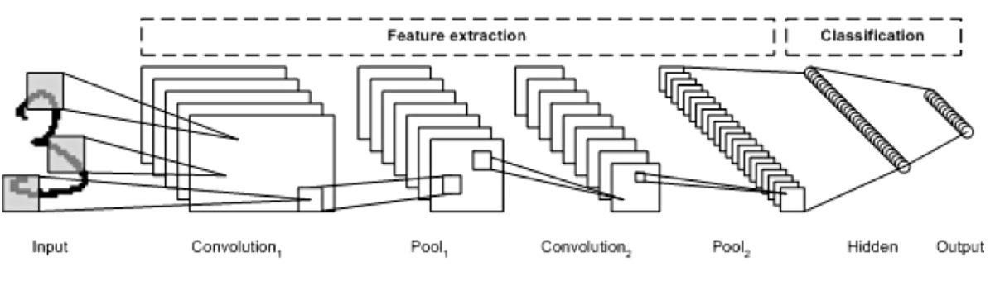
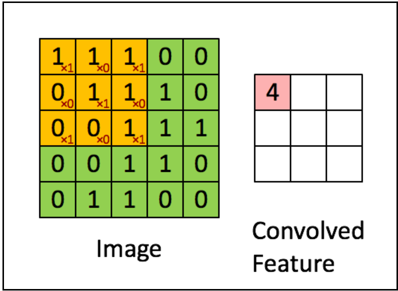
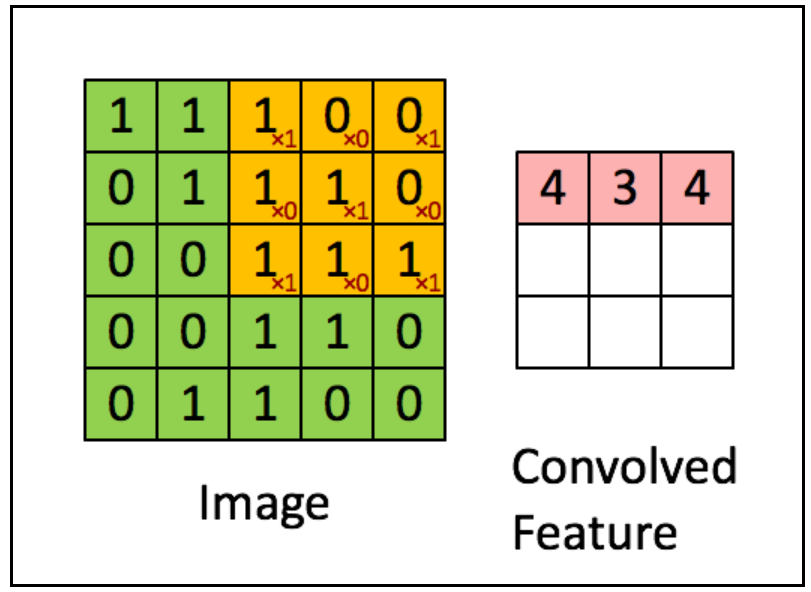
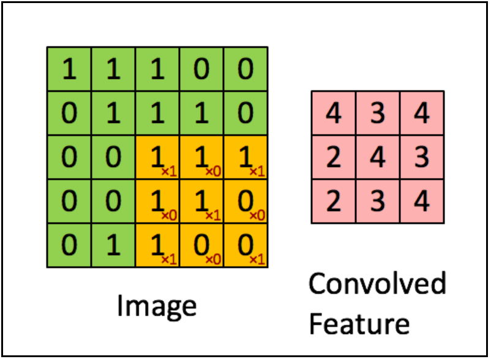
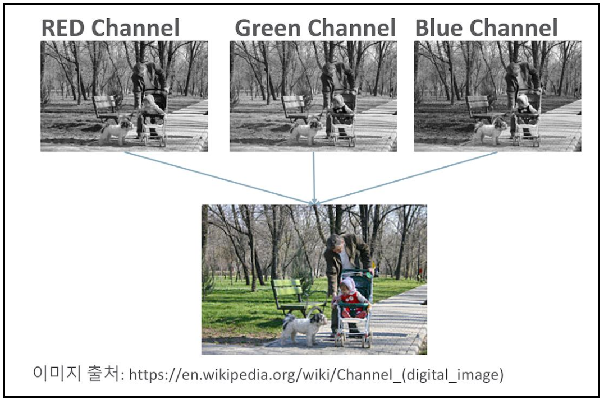
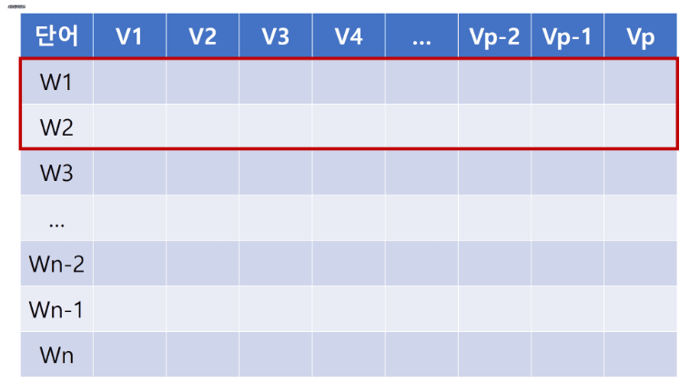
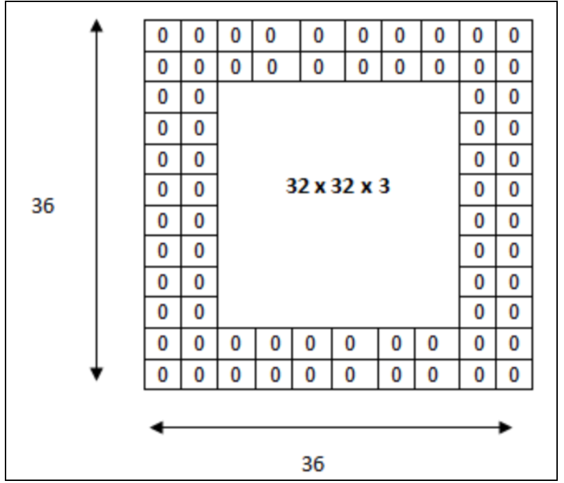
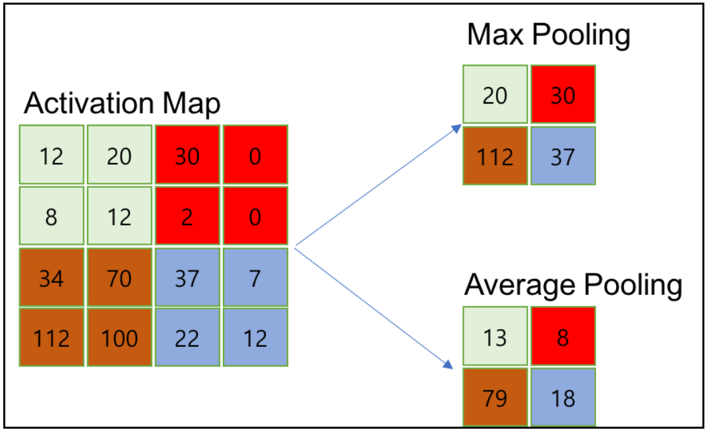
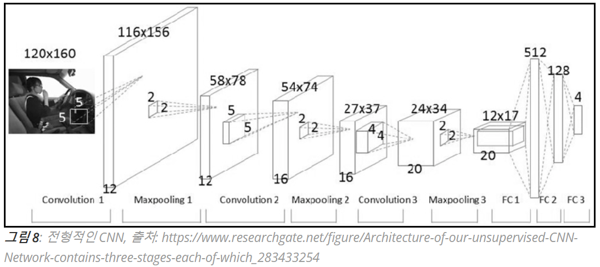

# DL_study_homework_week_5

## CNN(Convolution Neural Network)

CNN은 기존 Fully Connected Neural Network와 비교하여 다음과 같은 차별성을 갖는다.

- 각 레이어의 입출력 데이터의 형상 유지
- 이미지의 공간 정보를 유지하면서 인접 이미지와의 특징을 효과적으로 인식
- 복수의 필터로 이미지의 특징 추출 및 학습
- 추출한 이미지의 특징을 모으고 강화하는 Pooling 레이어
- 필터를 공유 파라미터로 사용하기 때문에, 일반 인공 신경망과 비교하여 학습 파라미터가 매우 적음

---

### 합성곱, Convolution

> *합성곱 연산은 두 함수 f, g 가운데 하나의 함수를 반전(reverse), 전이(shift)시킨 다음, 다른 하나의 함수와 곱한 결과를 적분하는 것을 의미한다. 출처: https://ko.wikipedia.org/wiki/합성곱*

> 먼저 임의의 변수(dummy variable)를 정의한다. (이 경우에는 $\tau$를 정의함) 이제 정의한 변수를 축으로 두 함수의 파형을 그린다. 그 다음으로 두 함수 중 하나를 선택해 $\tau$ 축에 대해 반전(time-invert)하고 t를 더한다. (어떤 함수를 선택하든지 관계 없다.) 방금 선택한 함수는 $\tau$ -축에 대해 앞뒤로 움직일 수 있다. 이때 t 변수의 값이 변화하지만 위 그림에서 파형의 뾰족한 부분은 항상 t-1에 위치해 있다. 이제는 음의 무한대에서부터 양의 무한대까지 선택한 함수를 이동시키면서 두 함수의 곱의 적분 값을 찾는다. 이 결과를 파형으로 표시한 것이 바로 두 함수의 합성곱이다.

$$(f \ast g)(t) = \int_{-\infty}^{\infty} f(\tau)g(t - \tau)d\tau$$

$$(f \ast g)(t) = \int_{-\infty}^{\infty} f(t - \tau)g(\tau)d\tau$$

---

### 채널, Channel

이미지 픽셀 하나하나는 실수이다. 컬러 사진은 천연색을 표현하기 위해서, 각 픽셀을 RGB 3개의 실수로 표현한 3차원 데이터이다.(<그림 2> 참조) 컬러 이미지는 3개의 채널로 구성된다. 반면에 흑백 명암만을 표현하는 흑백 사진은 2차원 데이터로 1개 채널로 구성된다. 높이가 39 픽셀이고 폭이 31 픽셀인 컬러 사진 데이터의 shape은 (39, 31, 3)3으로 표현한다. 반면에 높이가 39픽셀이고 폭이 31픽셀인 흑백 사진 데이터의 shape은 (39, 31, 1)이다.

---

### 필터, Filter

필터는 이미지의 특성을 찾아내기 위한 공용 파라미터이다. Filter를 Kernel이라고 한다. CNN에서 Filter와 Kernel은 같은 의미이다. 필터는 일반적으로 (4,4)나 (3,3)과 같은 정사각 행렬로 정의된다. 모든 채널(컬러의 경우 3개)의 합성곱의 합을 Feature Map으로 만든다. 이때 지정된 간격으로 필터를 순회하는 간격을 Stride라고 한다. stride가 2로 설정되면 필터는 2칸씩 이동하면서 합성곱을 계산한다. Feature Map은 합성곱 계산으로 만들어진 행렬이며, Acitvation Map은 Feature Map 행렬에 활성 함수를 적용한 결과이다. 즉 Convolution layer의 최종 출력 결과가 Activation Map이다.

text CNN의 경우 필터의 크기가 1이라면 Unigram, 2라면 Bigram, 3이면 Trigram. 이런 식으로 필터의 크기를 조절함으로써 다양한 N-gram 모델을 만들 수 있다.

---

### 패딩, Padding

Convolution 레이어의 출력 데이터가 줄어드는 것을 방지하는 방법이 패딩이다. 패딩은 입력 데이터의 외각에 지정된 픽셀만큼 특정 값으로 채워 넣는 것을 의미한다. 보통 패딩 값으로 0으로 채워 넣는다.

---

### Pooling layer

pooling layer는 convolution layer의 출력 데이터를 입력으로 받아 Activation Map의 크기를 줄이거나 특정 데이터를 강조하는 용도로 사용된다. 풀링 레이어를 처리하는 방법으로는 Max Pooling과 Average Pooling, Min Pooling이 있다. CNN에서는 주로 Max pooling을 사용한다.

### Convolution layer output data 크기 산정

- 입력 데이터 높이: H(Height)
- 입력 데이터 폭: W(width)
- 필터 높이: FH(Filter Height)
- 필터 폭: FW(Filter Width)
- Stride 크기: S(Stride)
- 패딩 사이즈: P(Padding)

> $OutputHeight = OH = {(H + 2P - FH) \over S} + 1$$OutputWidth = OW = {(W + 2P - FW) \over S} + 1$

이때 결과는 자연수가 되어야 하며, Convolution layer 다음에 Pooling layer가 온다면, Feature Map의 행과 열 크기는 Pooling 크기의 배수이어야 한다. 만약 Pooling size가 (3,3)이라면 위 식의 결과는 3의 배수이어야 한다. 이 조건을 만족하도록 Filter의 크기, Stride, Pooling size, Padding size를 조절해야 한다.

### Pooling layer 출력 데이터 크기 산정

Pooling layer에서 일반적으로 사이즈는 정사각행렬이다. Pooling size를 Stride와 같은 크기로 만들어서, 모든 요소가 한번씩 Pooling 되도록 만든다. 입력 데이터의 행 크기와 열 크기는 Pooling 사이즈의 배수이어야 한다. 결과적으로 Pooling layer의 출력 크기는 행과 열의 크기를 Pooling size로 나눈 몫이다. 예를 들어, Pooling size가 (2,2)라면 출력 데이터 크기는 입력 데이터의 행과 열 크기를 2로 나눈 몫이다.

> $OutputRowSize = {InputRowSize \over PoolingSize}$$OutputColumnSize = {InputColumnSize \over PoolingSize}$

## CNN 구성

CNN은 Convolution layer와 Max Pooling layer를 반복적으로 stack을 쌓는 특징 추출(Feature Extraction) 부분과 Fully Connected Layer를 구성하고 마지막 출력층에 Softmax를 적용한 분류 부분으로 나뉜다. Filter, stride, Padding을 조절하여 특징 추출(Feature Extraction) 부분의 입력과 출력 크기를 계산하고 맞추는 작업이 중요하다.

FC(Fully connected)로 구성된 신경망의 학습 파라미터를 살펴보면
인공 신경망의 총 파라미터는 백만 개가 넘습니다. 예제 CNN 파라미터와 비교하면 10배 이상의 학습 파라미터를 갖습니다. 은닉층을 더 깊게 만들 경우 Fully Connected Neural Network과 CNN과의 학습 파라미터의 차이는 더 급격하게 늘어납니다. CNN은 Fully Connected Neural Network과 비교하여 다음과 같은 특징을 갖습니다.

- CNN은 학습 파라미터 수가 매우 작다.
- 학습 파라미터가 작고, 학습이 쉽고 네트워크 처리 속도가 빠르다.

특징 추출 영역은 Filter를 사용하여 공유 파라미터 수를 최소화하면서 이미지의 특징을 찾는 Convolution 레이어와 특징을 강화하고 모으는 Pooling 레이어로 구성됩니다. CNN은 filter의 크기, stride, padding pooling 크기로 출력 데이터 크기를 조절하고, 필터의 개수로 출력 데이터의 채널을 결정한다.

참고
[CNN으로 문장 분류하기 · ratsgo's blog](https://ratsgo.github.io/natural%20language%20processing/2017/03/19/CNN/)[CNN, Convolutional Neural Network 요약](http://taewan.kim/post/cnn/#fn:3)