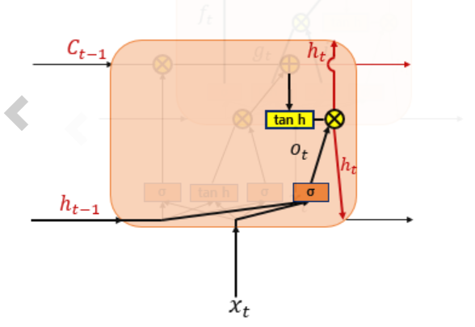

# DL_study_homework_week_6

# RNN(Recurrent Neural Networks)

- RNN은 히든 노드가 방향을 가진 엣지로 연결돼 순환구조를 이루는 인공신경망
- 기존 Neural network와는 다르게 '기억' 정보를 가지고 잇다.
- 시퀀스 길이에 관계없이  input과 output을 받아들일 수 있는 네트워크 구조이기 때문에 필요에 따라 다양하고 유연하게 구조를 만들 수 있다.
- RNN의 경우 text data, speech data, classification prediction problems, regression prediction problems, generative models 등의 많이 사용되지만, 최근의 경우 input에 CNN, middle에 LSTM, output에 MLP 로 구성된 모델을 사용하기도 한다. 이러한 모델은 sequence of image, such as video 에 사용된다. - CNN LSTM architecture

[When to Use MLP, CNN, and RNN Neural Networks](https://machinelearningmastery.com/when-to-use-mlp-cnn-and-rnn-neural-networks/)

$$\begin{matrix} h_t=tanh(W_xx_t + W_hh_{t-1} + b) \\y_t = f(w_yh_t + b)  \end{matrix}$$

 그림의 녹색박스는 히든 state이다. 현재의 히든 state는 직전의 히든 state를 받아 갱신된다.

 'hello' 라는 글자를 학습시킨다 하면, 일단 글자를 'one-hot-vector'로 바꾼다. 그 다음 'h'를 input으로 넣고 첫 hidden layer(왼쪽) 통과해서 순전파 단계를 거친다. 이때 첫 hidden layer는 랜덤으로 생성한다. 그 다음 ouput layer에 글자 'e'를 통해 back propagation을 실행한다. 

 다음 'e' 글자를 input으로 넣고 직전 hidden layer 또한 input으로 넣어 순전파를 실행한다. 다음 글자이 'l'을 통해 back propagation을 실행한다. 이런 식으로 순환적으로 신경망이 학습된다.

 weight의 크기는 다음과 같다.

 d : 단어 벡터의 차원

D_h : 은닉 상태의 크기

# RNN의 종류

## 일 대 다(one-to-many)

 one-to-many 모델은 하나의 이미지 입력에서 사진의 제목을 출력하는 이미지 캡셔닝(Image Captioning) 작업에 사용할 수 있다. 사진의 제목은 단어들의 나열이므로 시퀀스 출력이다.

## 다 대 일(many-to-one)

 단어 시퀀스에 대해 하나의 출력(many-to-one) 모델은 입력 문서가 긍정적인지 부정적인지 판별하는 감성 분류(sentiment classificatino), 또는 스팸 메일인지 판별하는 spam detection 등에 사용할 수 있다.

## 다 대 다(many-to-many)

 many-to-many 모델의 경우 입력 문장으로부터 대답 문장을 출력하는 챗봇과 번역기, 개체명 인식 등에서 사용할 수 있다.

# LSTM(Long Short-Term Memory)

 "I grew up in France... I speak French" 등 긴 문장에서 관련 정보와 그 정보를 사용하는 지점 사이 거리가 멀 경우, 역전파 gradient 가 줄어 학습 능력이 저하되는 점이 있다. 이러한 vanishing gradient problem을 해결하기 위해 나온 것이 LSTM이다.

  LSTM은 기존 RNN에 cell state라는 값을 추가하였다. 또한 은닉 상태값과 셀 상태값을 구하기 위해 3개의 게이트가 추가되었다. 각 게이트는 삭제 게이트, 입력 게이트, 출력 게이트가 있다.

## 입력 게이트

$$\begin{matrix} i_t = \sigma(W_{xi}x_t + W_{hi}h_{t-1}+b_i) \\ g_t = tanh(W_{xg}x_t + W_{hg}h_{t-1}+b_g) \end{matrix}$$

 입력 게이트는 현재 정보를 기억하기 위한 게이트입니다. 우선 현재 시점 t의 x값과 입력 게이트로 이어지는 가중치 Wxi를 곱한 값과 이전 시점 t-1의 은닉 상태가 입력 게이트로 이어지는 가중치 Whi를 곱한 값을 더하여 시그모이드 함수를 지납니다. 이를 it라고 합니다.

 그리고 현재 시점 t의 x값과 입력 게이트로 이어지는 가중치 Wxi를 곱한 값과 이전 시점 t-1의 은닉 상태가 입력 게이트로 이어지는 가중치 Whg를 곱한 값을 더하여 하이퍼볼릭탄젠트 함수를 지납니다. 이를 gt라고 합니다.

 시그모이드 함수를 지나 0과 1 사이의 값과 하이퍼볼릭탄젠트 함수를 지나 -1과 1사이의 값 두 개가 나오게 됩니다. 이 두 개의 값을 가지고 이번에 선택된 기억할 정보의 양을 정합니다.

## 삭제 게이트

$$f_t= \sigma(W_{xf}x_t + W_{hf}h_{t-1}+b_f)$$

 삭제 게이트는 기억을 삭제하기 위한 게이트입니다. 현재 시점 t의 x값과 이전 시점 t-1의 은닉 상태가 시그모이드 함수를 지나게 됩니다. 시그모이드 함수를 지나면 0과 1 사이의 값이 나오게 되는데, 이 값이 곧 삭제 과정을 거친 정보의 양입니다. 0에 가까울수록 정보가 많이 삭제된 것이고 1에 가까울수록 정보를 온전히 기억한 것입니다.

# 셀 상태(cell state) - 장기상태

$$C_t = f_t *C_{t-1} + i_t*g_t$$

 셀 상태 Ct를 LSTM에서는 장기 상태라고 부르기도 합니다. 그렇다면 셀 상태를 구하는 방법을 알아보겠습니다. 삭제 게이트에서 일부 기억을 잃은 상태입니다.

 삭제 게이트와 입력 게이트의 영향력을 이해해봅시다. 만약 삭제 게이트의 출력값인 ft가 0이 된다면, 이전 시점의 셀 상태값인 Ct−1은 현재 시점의 셀 상태값을 결정하기 위한 영향력이 0이 되면서, 오직 입력 게이트의 결과만이 현재 시점의 셀 상태값 Ct을 결정할 수 있습니다. 이는 삭제 게이트가 완전히 닫히고 입력 게이트를 연 상태를 의미합니다. 반대로 입력 게이트의 it값을 0이라고 한다면, 현재 시점의 셀 상태값 Ct는 오직 이전 시점의 셀 상태값 Ct−1의 값에만 의존합니다. 이는 입력 게이트를 완전히 닫고 삭제 게이트만을 연 상태를 의미합니다. 결과적으로 삭제 게이트는 이전 시점의 입력을 얼마나 반영할지를 의미하고, 입력 게이트는 현재 시점의 입력을 얼마나 반영할지를 결정합니다.

## 출력 게이트와 은닉 상태(hidden state) - 단기 상태

$$\begin{matrix} o_t = \sigma(W_{xo}x_t+ W_{ho}h_{t-1}+b_o) \\ h_t = o_t * tanh(c_t) \end{matrix}$$

 출력 게이트는 현재 시점 t의 xx값과 이전 시점 t-1의 은닉 상태가 시그모이드 함수를 지난 값입니다. 해당 값은 현재 시점 t의 은닉 상태를 결정하는 일에 쓰이게 됩니다.

 은닉 상태를 단기 상태라고 하기도 합니다. 은닉 상태는 장기 상태의 값이 하이퍼볼릭탄젠트 함수를 지나 -1과 1사이의 값입니다. 해당 값은 출력 게이트의 값과 연산되면서, 값이 걸러지는 효과가 발생합니다. 단기 상태의 값은 또한 출력층으로도 향합니다.

[위키독스](https://wikidocs.net/22888)

[위키독스](https://wikidocs.net/22886)

[RNN과 LSTM을 이해해보자!](https://ratsgo.github.io/natural%20language%20processing/2017/03/09/rnnlstm/)