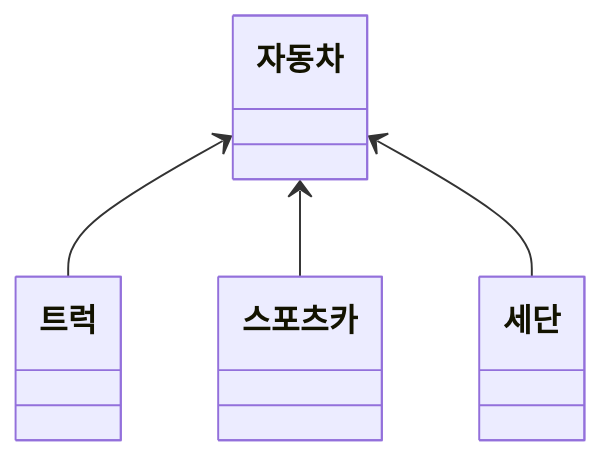
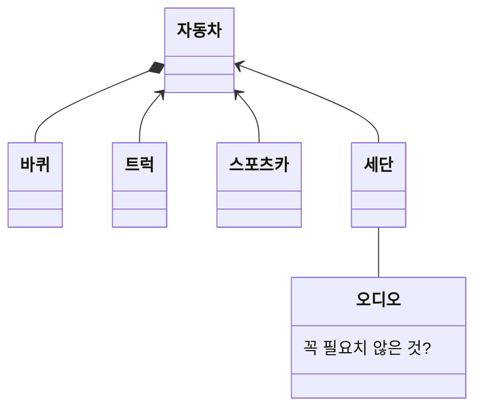

# 문서를 읽기 전(README)

- 이 문서의 저작권은 '팽대원(FoRA)'에게 있음.
- 중요하다고 생각되는 단어 및 문장은 ***강조 효과***를 달았음.
- 추가적인 설명은 다음과 같이 회색으로 각주 효과를 달았음.

> 각주효과, 각주효과, 각주효과

# Design Pattern(디자인 패턴)

### is-a 관계를 보여주는 class_diagram 

추상 클래스와 파생 클래스로 설명되며 `트럭 is a 자동차` 라는 is-a 관계를 띈다.

여기선 추상클래스는 자동차이고, 파생 클래스는 트럭, 스포츠카, 세단을 뜻한다.

### has-a 관계를 보여주는 class_diagram 

자동차는 바퀴를 가지고 있다. 즉, `자동차 has a 바퀴` 관계는 has-a 관계이다.

이때, 바퀴처럼 필수적인 부분은 **채워진 다이아몬드**로 그리고 주차장-자동차의 관계처럼 일부분은 아니지만 가지고 있을 경우를 **비어있는 다이아몬드**로 그린다.

**채워진 다이아몬드**는 집합연관이라 하고, **비어있는 다이아몬드**는 복합연관이라 한다.